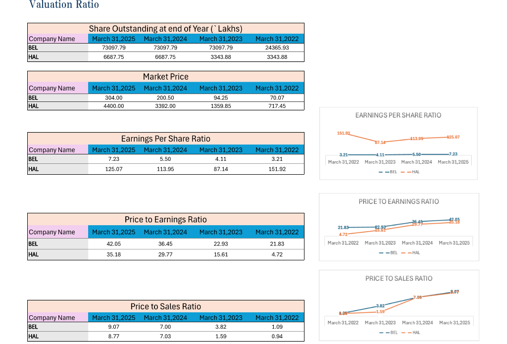

# Ashutosh Singh | DVA Specialist & Full-Stack Developer

🌐 **Live Portfolio:** [portfolio-dva-three.vercel.app](https://portfolio-dva-three.vercel.app/)

ash_2024@rishihood.edu.in | [GitHub](https://github.com/ashyou09) | [LinkedIn](https://www.linkedin.com/in/ashutosh-singh2024/)

---

## Summary

Data Analyst expert in **Excel**, **Tableau**, and **MySQL**, turning complex datasets into clear, actionable intelligence. I leverage **Python**, **Pandas**, **NumPy**, **Seaborn**, and **Plotly** to build scalable models and dashboards to drive data-driven decision-making, specializing in **Data Visualization & Analytics (DVA)** and **Full-Stack Engineering**.

---

## Technical Skills

**Data Visualization & Analytics:**
Tableau, Excel, Spreadsheet Modeling, Pandas, Matplotlib, NumPy

**Full-Stack Development:**
React, Next.js, Node.js, Express JS, TypeScript, Tailwind CSS, HTML, CSS

**Backend & Infrastructure:**
Docker, Kubernetes, Terraform, Python, SQL, Git/GitHub, Unit Testing

**AI & Machine Learning:**
Generative AI, LangChain, LangGraph

**Databases:**
MySQL, MongoDB, Prisma ORM

---

## Featured Projects

### [Global AQI Analytics Dashboard](https://public.tableau.com/app/profile/mausam.kumar8507/viz/Tableau_Dashboard_Final/DB-3Solutions?publish=yes)

- **Environmental Monitoring**: Advanced Tableau dashboard providing comprehensive visual insights into global Air Quality Index (AQI) trends and viable solutions.

### [Valuation Ratio Analysis](https://rishihoodeduin-my.sharepoint.com/:x:/g/personal/ash_2024_rishihood_edu_in/IQBbGoQPq5u0SLtJhKmqlhSQAcHgr4ppBbgscZXhsJnJb5o?e=wZgwOu)

- **Financial Modeling**: Comprehensive valuation ratio analysis for BEL and HAL, tracking metrics like Earnings Per Share, Price to Earnings, and Price to Sales ratios.

### [DuPont Analysis](https://rishihoodeduin-my.sharepoint.com/:x:/g/personal/ash_2024_rishihood_edu_in/IQAL6yxnUDqJQYb0YDBQXqfWAWRR0ethlFhi_n2mPbYjHZw?e=gOOFzF)

- **Corporate Finance Dashboard**: 3-Stage and 5-Stage DuPont Analysis focusing on Return on Asset (ROA) and Return on Equity (ROE) for organizations like TCS and ONGC.

### [AI at Work: Efficiency vs Stability](https://docs.google.com/spreadsheets/d/1hXWgkVV1PRSaZfl86P68GkNQflubBdjYmwfvNE2n8Pk/edit?gid=1369173376#gid=1369173376)

- **Workforce Analytics**: An interactive dashboard evaluating the impact of AI adoption across different roles, analyzing the balance between increased productivity and burnout risk.

---

## Soft Skills
Leadership, Research-Oriented, Critical Thinking, Problem-Solving, Cross-Functional Collaboration
